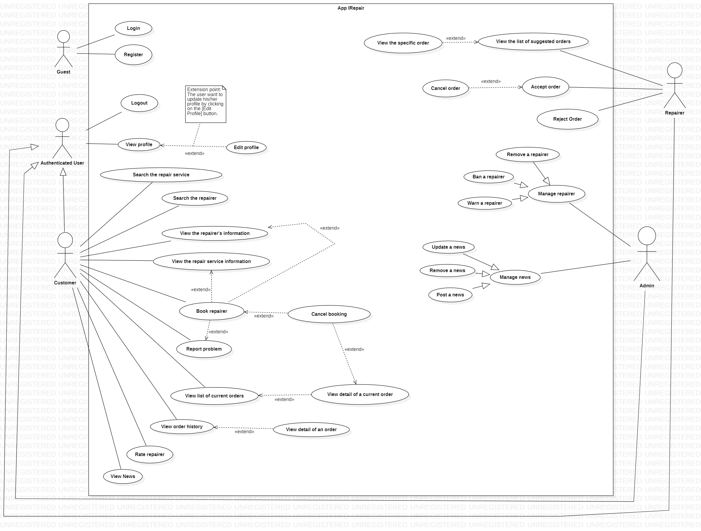
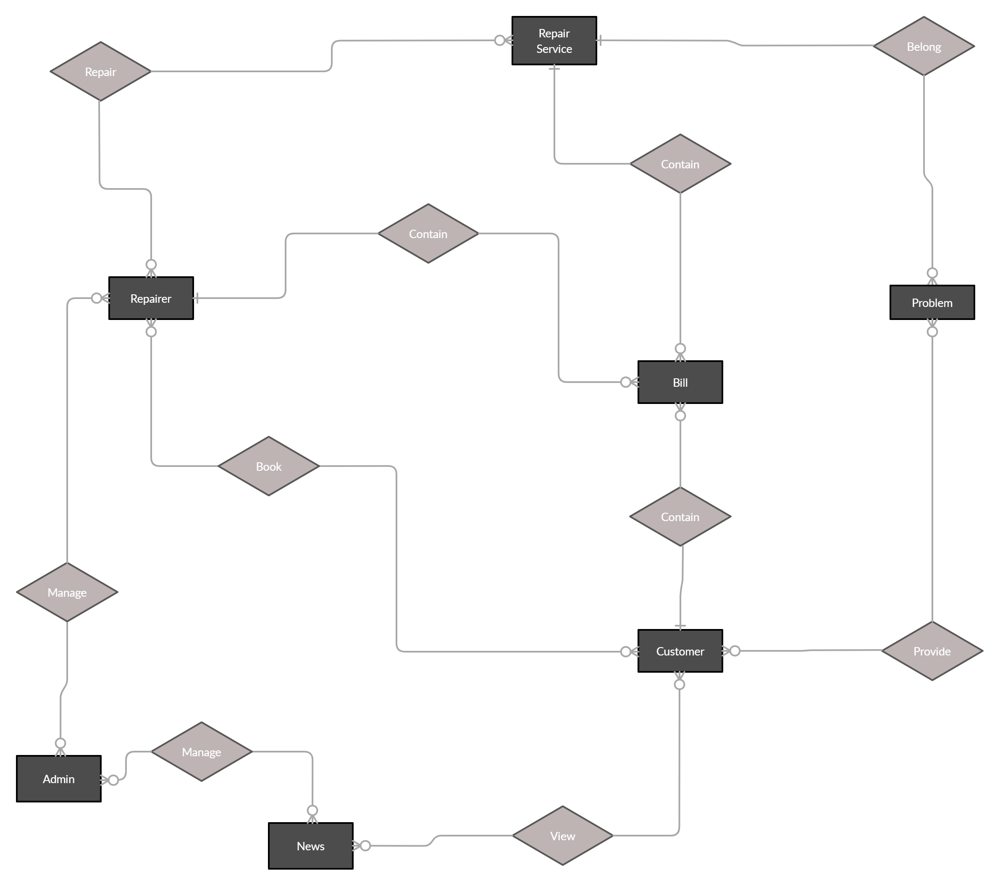
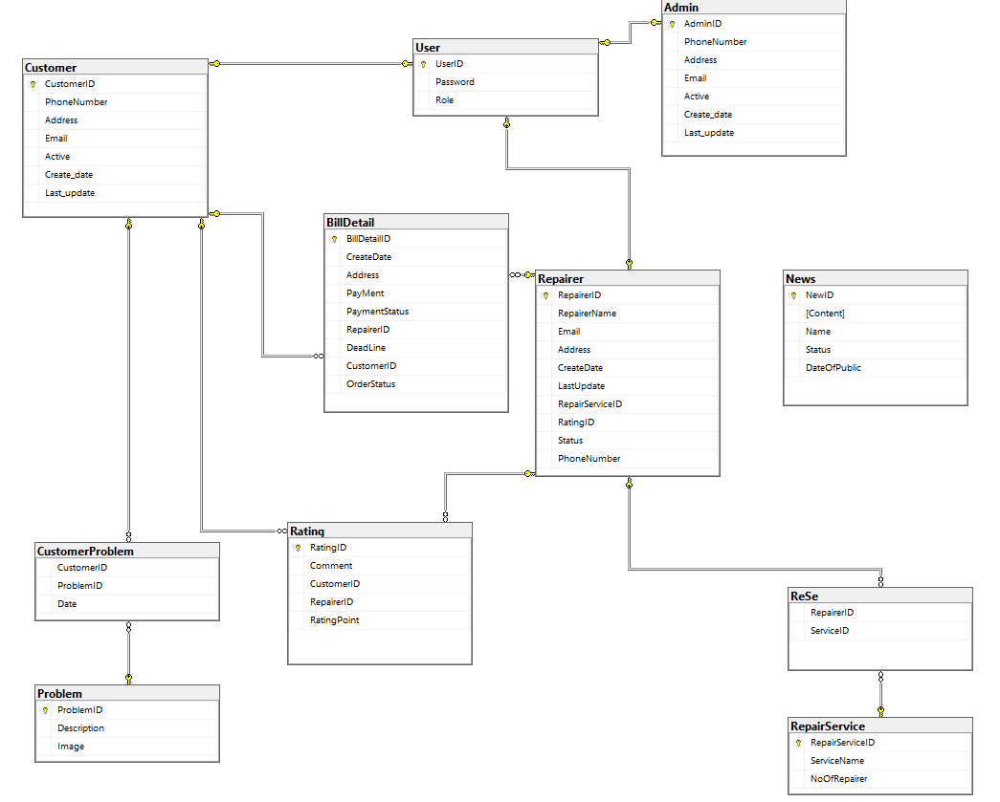

# Welcome to the README.md of IRepair

- This is a quick description about the software requirement: IRepair
- It's a group project made in 2020
- It's only a requirement so it should be simple and a bit **not real**

# 1. Usecase Diagram:

# 2. Entity Relationship Diagram:

# 3. Database:

